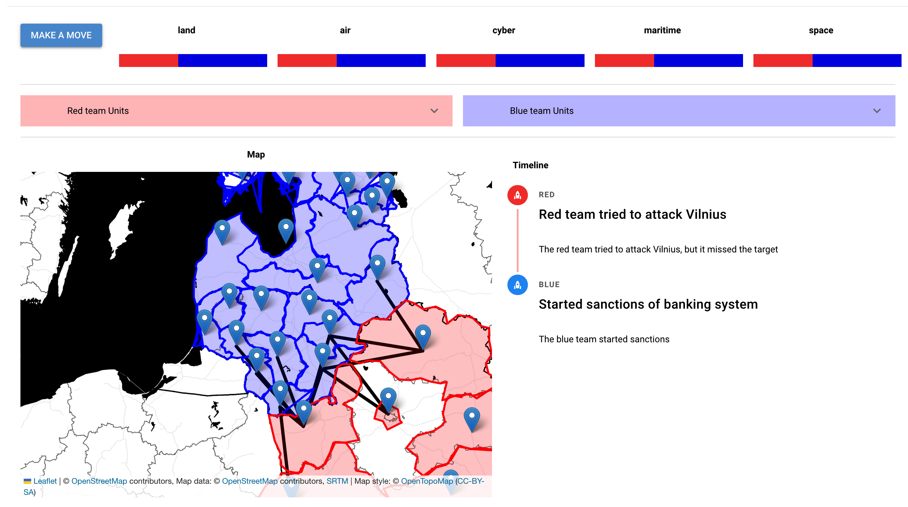
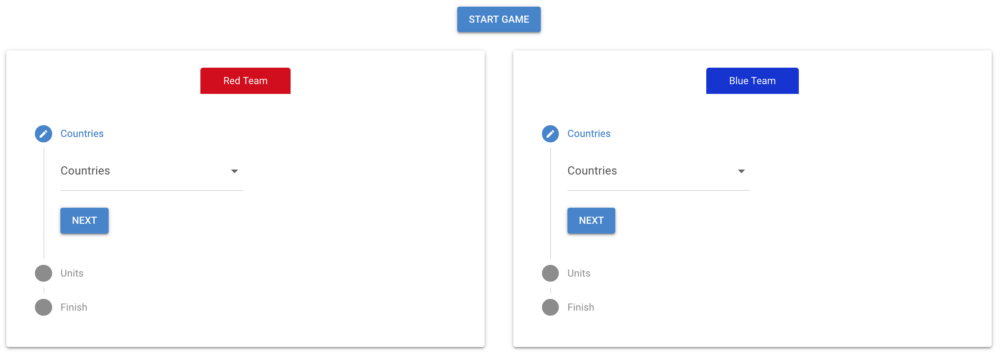
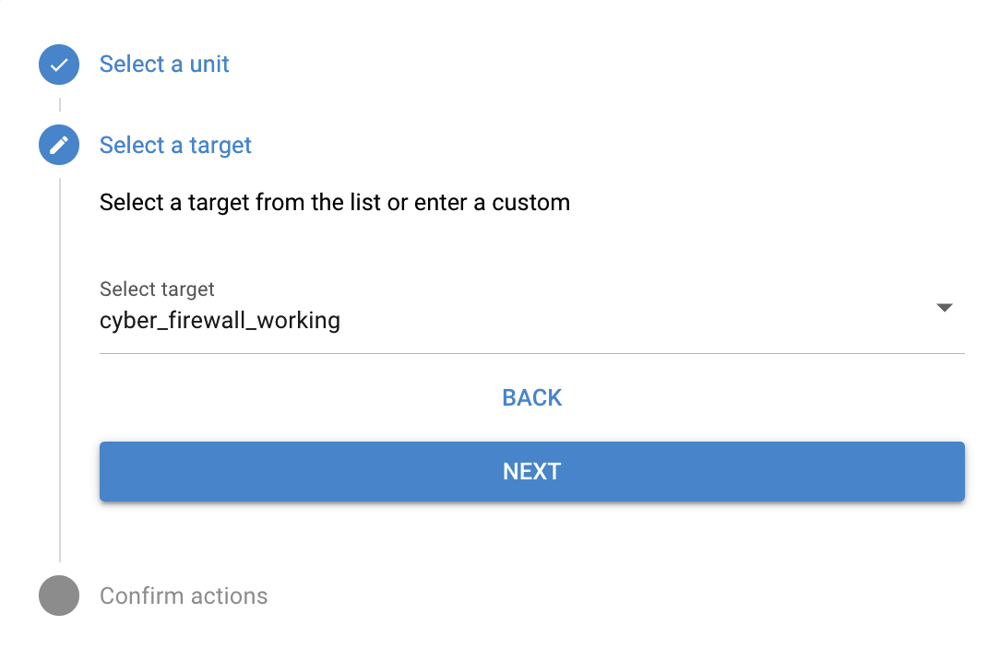
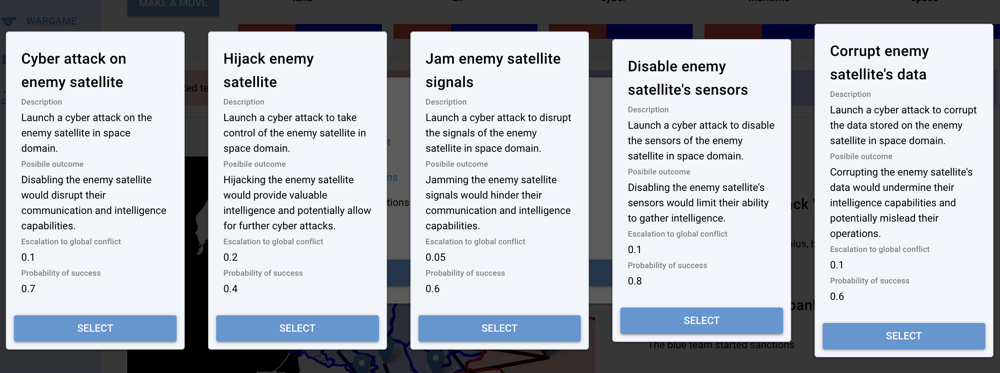
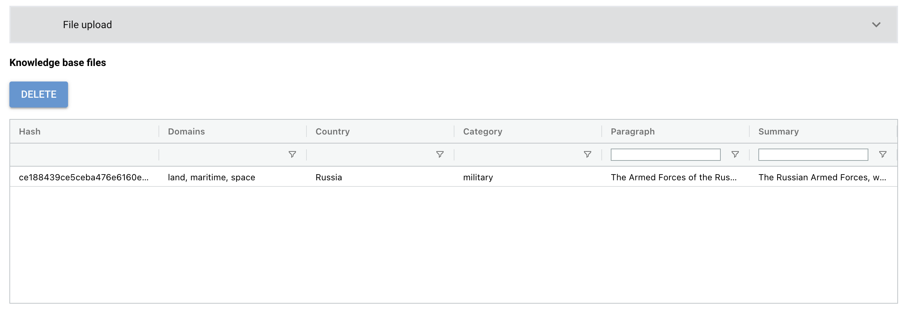

# WarSim: A LLM-Driven Wargaming Simulator

WarSim is an immersive wargaming simulator designed to evaluate your strategic choices in various wartime scenarios. Leveraging the capabilities of OpenAI's ChatGPT 4, the platform generates a range of potential actions and their outcomes based on the combatants involved, their available resources, and the status of their respective domains, including air, land, navy, cyber, and space. This interactive tool provides a detailed analysis of warfare strategies, helping players navigate complex military situations with greater insight.



## Main features

Our wargaming simulator is designed with numerous features to enhance the realism of your wargaming experience:
1. It features a straightforward and intuitive system for customizing scenarios, giving you complete control over the simulations. 
2. The simulator supports simulations across all five military domains. This allows you to perform actions in any domain(s) and observe their impact on the others.
3. An integrated Large Language Model (LLM) within our system not only suggests the best strategic moves for your selected units but also provides detailed descriptions, probabilities, and their overall impact on the global conflict scale. 
4. Moreover, the LLM is adept at determining the most likely outcomes of specific events. You will also receive a comprehensive analysis of how these outcomes influence the military domains of each team, as well as the units they possess.
5. Provide additional context about each team in any text format or file. This information will be incorporated as context in the prompts for the Large Language Model (LLM) system, so feel free to include any details you deem necessary.

## TLDR (quick setup)

1. Make sure Docker and Docker Compose are installed on the system. 
2. Create an .env file by copying the .env_example file, then insert your OpenAI API key into this file.
3. In the project folder, execute the `docker compose up` command and wait for Docker to complete its setup.
4. After the Docker setup is finished, go to [http://localhost:8080](http://localhost:8080) to access and enjoy the wargaming simulator.

# Table of Contents

1. [Instalation](#installation) \
1.1. [Prerequisites](#prerequisites) \
1.2. [Runing the Program](#runing-the-program)

2. [Getting started](#getting-started)
3. [Simulation Setup](#simulation-setup) \
3.1. [Adding Unit Types](#adding-unit-types) \
3.2. [Adding game definitions](#adding-game-definitions)

4. [FAQ](#faq)

# Installation
## Prerequisites

Before you can run the WarSim wargaming simulator, ensure that the following programs are installed and operational on your system:
- Install [Docker](https://docs.docker.com/engine/install/)
- Install [Docker Compose](https://docs.docker.com/compose/install/)

Additionally, you'll require an API key and an endpoint from OpenAI's Azure studio to operate the ChatGPT model. To do this, copy the [.env_example](/.env_example) file and input your specific deployment key and endpoint details there.

## Runing the Program

The program is deployed using Docker containers. To launch them, execute the following command:
```
docker compose up
```
Building all the containers and completing the setup may take a few minutes, so feel free to sit back and relax for a bit 😌

Once Docker has finished building, your setup will be complete.

# Getting Started

Welcome to the beginning of your WarSim experience! You'll find here a step-by-step guide to get you started with setting up your simulation.

### Step 1: Access the Simulation Dashboard

To begin, navigate to the simulation dashboard by opening the following link in your web browser:

[http://localhost:8080](http://localhost:8080)

This link will become active after you've successfully completed the setup process as outlined in the installation instructions. **You can start using the default simulation immediately**. If you wish to set up your own scenario, simply follow the steps provided below.

### Step 2: Configuring Your Game

Upon accessing the dashboard, you'll have the option to customize your game. You can choose to configure the game settings manually using the various options provided, or you can proceed with the default values for a quick start.

### Step 3: Starting the Game

Click on the `NEW GAMEPLAY` button located on the left side of the game screen. This will take you to a screen where you can select the parameters for both teams, including choosing the participating countries and specifying their units.



After configuring each side playing side, press the `START THE GAME` button to start your simulation.

### Step 4: Making Moves in the Selected Scenario

To make a move, first click on the `MAKE A MOVE` button in the game's user interface, located in the top left corner. Then, in the table that appears, select the acting unit and the target unit. After this, press the `GENERATE ACTIONS` button to see the possible actions for the acting units."



After this, the system, powered by the Large Language Model (LLM), will suggest the five best actions for the selected units. Choose one of these actions to see its impact on the current simulation state and how it will affect all five military domains.




# Simulation Setup

There are numerous external files available for customization to enhance the realism of your simulations. You can find all the configurable files in the [resources](app/resources/) folder. The main files for you to confifgure are:

- [units.json](app/resources/units.json)
- [types.json](app/resources/types.json)

## Adding Unit Types

You can specify what types of units both of the teams can have. Do this by editing the [units.json](app/resources/units.json) config file. Each unit is described by three fields:
- **Domain**: This specifies one of the five military domains (land, air, cyber, maritime, and space) in which the unit operates, shaping its capabilities. It's important to note that units can impact those in other domains.
- **Name**. This is the identifier for the unit, primarily used for recognition and reference.
- **Description**. This field provides a context for the Language Learning Model (LLM), helping it understand the unit's capabilities and its role in the simulation. There are no specific requirements for this text; it's a free-form field intended to describe the unit comprehensively.

In the [units.json](app/resources/units.json) configuration file, you'll find several predefined units. You're free to delete these and add your own. However, it's important to maintain the same JSON format when making changes. For example:

```json
[
  {
    "domain": "land",
    "name": "army base",
    "description": "A base for the army to store and maintain their equipment and personnel. It uses a variety railways and roads to travel."
  },
  {
    "domain": "land",
    "name": "infrastructure",
    "description": "Infrastructure is used to move troops and equipment. It uses a variety of railways and roads to travel."
  }
]
```

## Adding game definitions

In the [types.json](app/resources/types.json) file, you have the opportunity to define the core aspects of your simulation. This file comes pre-loaded with a set of definitions, which you can modify or augment to ensure accuracy if the Language Learning Model (LLM) is not interpreting certain aspects as intended. These definitions are crucial for directing the LLM's understanding of the selected domains and actions within the simulation. They are integrated into the system prompts for various actions to provide context and guidance.

Adding new definitions is straightforward. Simply introduce an additional key-value pair (`"name": "description"`) into the configuration file. Once added, these definitions will be automatically incorporated into the LLM system prompts when the simulation starts, enhancing the contextual understanding of the LLM.

# FAQ

1. How do you turn off the system?

Simply run the `docker compose down` command and the docker containers should safely be closed. If you want to rerun the the program, run the `docker compose up` command again.

2. How to add additional context files to your simulation?

Go to the `VAULT` section, which you can find in the left menu of the game screen. Here, you'll have the option to upload text or structured files with the context information that you wish to include in the Large Language Model (LLM) system prompts.



# Credits

Developed during TIDE Hackathon 2024 by team CARD:
- Milita Songailaitė
- Mindaugas Petkevičius
- Anton Volčok
- Eimantas Zaranka